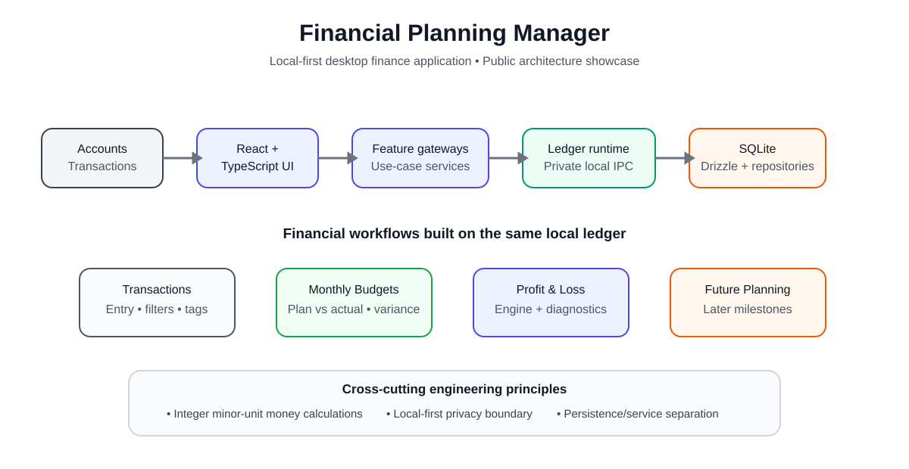

# Financial Planning Manager — Showcase

A **local-first desktop financial management application** that connects everyday
money records with budgeting, financial statements, long-term plans, and periodic
review.

> **Portfolio showcase.**  
> This page explains the intended completed product experience and system design.
> The production repository remains private, and this public showcase contains no
> personal financial records, private spreadsheets, local databases, credentials,
> or production implementation source.

## What the completed product does

The application keeps a user's financial data on their own device and turns recorded
money movement into a structured decision workflow.

```text
Accounts / Imports
       │
       ▼
Transactions + Transfers
       │
       ▼
   Local Ledger
       │
       ├──────────────► Monthly Budgets
       │                     │
       │                     ▼
       │               Plan vs. Actual
       │                     │
       │                     ▼
       │                Variance Review
       │
       ├──────────────► Financial Statements
       │                 PL • BS • CF
       │
       └──────────────► Financial Planning
                         │
                         ▼
                Goals • Targets • Horizons
                         │
                         ▼
                    Plan Reviews
                         │
                         ▼
               Updated financial decisions
```

The goal is not only to record spending. It is to create a traceable path from
**actual financial activity → financial understanding → future plans → review**.

## How it works

### 1. Record financial activity

The user creates local accounts and records transactions such as salary, groceries,
rent, subscriptions, or other income and expenses.

Account-to-account transfers are modeled separately from income and expenses so that
moving money between accounts does not distort financial performance.

Transactions can be categorized and tagged, creating a consistent ledger that can be
reused by budgets, reports, and planning.

### 2. Manage monthly budgets

For each month, the user creates category-level planned amounts.

The application compares the plan with actual posted ledger activity and calculates:

- planned amount
- actual amount
- variance
- achievement / utilization ratio
- overspend, underspend, or on-target status

Actual values come from the ledger rather than being copied into the budget itself.
This means editing a transaction automatically changes the relevant budget result
while preserving the original plan.

A previous month's **plan** can be reused for the next month without carrying over
the previous month's actual spending.

### 3. Understand financial performance

The statement layer converts the same ledger into standard financial views.

The completed system is designed to provide:

- **Profit and Loss (PL)** — income, expenses, and net result over a period
- **Balance Sheet (BS)** — assets, liabilities, and balances at a point in time
- **Cash Flow (CF)** — cash movement classified by financial purpose

Statement calculations retain source provenance and diagnostics so the user can see
where numbers came from and when data is incomplete or inconsistent.

### 4. Build future plans

The planning layer turns financial goals into structured plans.

A plan can contain:

- a name and planning horizon
- target dates
- target values
- hierarchical sub-goals
- assumptions
- tags
- review notes
- status

For example:

```text
Plan: Build a 6-month emergency fund
│
├── Target: ¥1,800,000
│
├── Monthly saving target: ¥75,000
│
├── Reduce discretionary spending
│
└── Review progress every month
```

Plans are connected conceptually to the same financial data used by budgets and
statements, so goals can be reviewed against actual financial results rather than
maintained as isolated notes.

### 5. Review progress

The application stores plan reviews over time.

Each review can capture:

- review date
- actual value
- progress summary
- variance explanation
- status assessment

This creates a feedback loop:

```text
Plan
  ↓
Financial activity
  ↓
Budget / statement results
  ↓
Review
  ↓
Adjust plan or behavior
  ↓
Next review
```

The completed product therefore acts as both a **financial record system** and a
**personal planning system**.

## Desktop architecture



The application is designed as **desktop-first, offline-first, single-user, and
privacy-oriented**.

| Area | Technology |
|---|---|
| Desktop shell | Tauri |
| Frontend | React + TypeScript |
| Build tooling | Vite |
| Local database | SQLite |
| Persistence | Drizzle ORM + better-sqlite3 |
| Input validation | Zod |
| Client state | Zustand |
| Unit/integration testing | Vitest |
| Workflow testing | Playwright |
| Architecture enforcement | ESLint + dependency-cruiser |

The React UI communicates with feature gateways and use-case services rather than
accessing SQLite directly.

The native desktop layer connects to a local ledger runtime, which owns persistence
and financial data access. Repository and query-service boundaries isolate database
details from budgeting, statement, and planning logic.

## Core data model

The completed system is organized around a shared set of financial entities:

### Financial records

- Profiles
- Accounts
- Categories
- Tags
- Transactions
- Transfers

### Budgeting

- Budget periods
- Budget category lines
- Planned amounts
- Actual calculations
- Variance results

### Statements

- Statement definitions
- Reporting periods / as-of dates
- Source transactions
- Financial classifications
- Diagnostic information

### Planning

- Plans
- Plan nodes and sub-goals
- Target dates and values
- Assumptions
- Tags
- Plan reviews

### Data management

- Import jobs
- Export jobs
- Backup records
- Backup verification status

## Important design decisions

### Local-first privacy

Financial information stays on the user's computer by default.

The application does not require a cloud account merely to manage a personal ledger.
Local SQLite storage is the primary source of truth.

Private information such as real transactions, balances, planning notes, exports,
backups, and databases is kept outside the public source repository.

### Integer money calculations

Money is stored and calculated using **integer minor units** rather than binary
floating-point values.

For example:

```text
¥12,345  → 12345 minor units
A$123.45 → 12345 cents
```

This avoids floating-point rounding errors in financial aggregation.

### Explicit transfers

A transfer between two owned accounts is not treated as income or spending.

For example:

```text
Checking → Savings: A$500

Checking balance   -500
Savings balance    +500
Income/expense        0
```

This distinction is essential for meaningful budgets and statements.

### One ledger, multiple views

Transactions are recorded once.

Budget results, statements, and planning reviews derive information from the same
underlying financial records rather than maintaining separate copies of the truth.

### Traceable calculations

Calculated outputs are designed to retain enough source information to explain how a
result was produced.

This is particularly important for financial statements and planning reviews, where
a plausible-looking number is not sufficient if its source cannot be understood.

## Example end-to-end workflow

A user could use the completed application like this:

1. Create checking, savings, and credit-card accounts.
2. Record or import salary and daily transactions.
3. Categorize spending and add useful tags.
4. Create the month's budget.
5. Compare planned and actual spending throughout the month.
6. Review overspending and adjust behavior where appropriate.
7. Open PL, BS, and CF views to understand overall financial position.
8. Create a long-term plan, such as building an emergency fund or saving for travel.
9. Set a target amount and target date.
10. Review progress using current financial data.
11. Record the review and adjust the plan when circumstances change.
12. Export or back up the local data when needed.

## Example: connecting a budget to a goal

Suppose a user wants to save **¥1,200,000 in 12 months**.

The planning layer defines the target:

```text
Goal: ¥1,200,000
Period: 12 months
Required average progress: ¥100,000 / month
```

The monthly budget can then reserve money for that goal.

At review time, the user can compare:

```text
Target progress     ¥400,000
Actual progress     ¥360,000
Variance            -¥40,000
Status              Behind target
```

The application does not need to treat the plan as an isolated checklist; it can be
reviewed using the financial records already stored in the ledger.

## Portfolio context

This is an **AI-assisted software development project**. My work includes product and
workflow definition, financial/domain modeling, architecture decisions, integration,
debugging, testing strategy, validation, and iterative refinement with AI coding
tools.

The private repository contains the working implementation and engineering history.
This public showcase focuses on **how the completed product is designed to work**.

## What remains private

This showcase intentionally excludes:

- production source code
- personal financial records
- local SQLite databases
- private spreadsheets and trackers
- raw logs and backups
- private screenshots
- machine-specific configuration
- internal development artifacts

If you are reviewing this project for a role, I can discuss the architecture,
financial modeling, workflow decisions, testing strategy, and selected sanitized
implementation examples.
